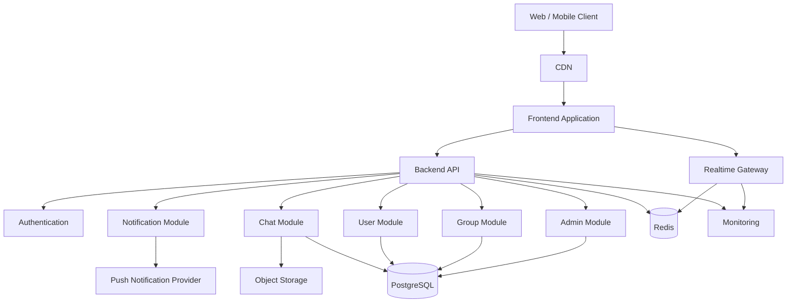
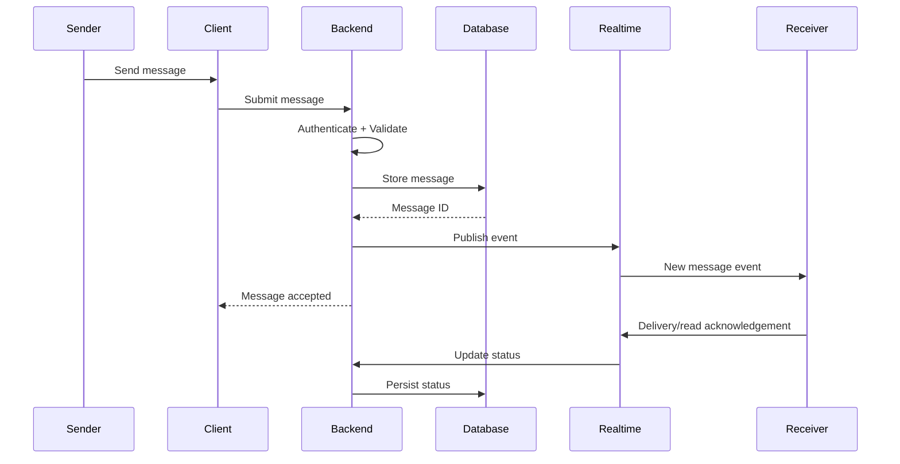
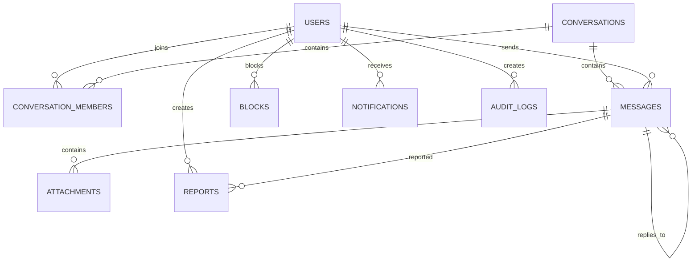
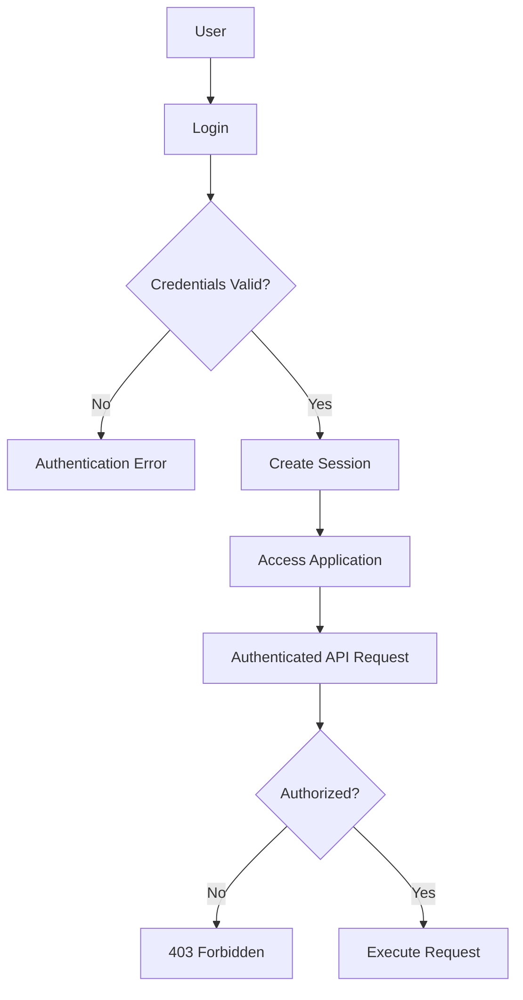
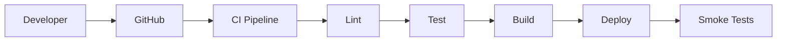

# PROJECT ANALYSIS

## 1. Project Understanding

**Project:** Chatting Application
**Project Type:** Real-time communication / social collaboration application

### Problem

Users need a reliable platform to communicate with other users through direct and potentially group conversations without depending on fragmented communication channels.

### Proposed Solution

A production-ready web/mobile-friendly chatting platform that provides:

* User registration and authentication
* User profiles
* One-to-one conversations
* Group conversations
* Real-time messaging
* Message status
* Online/offline presence
* Typing indicators
* Message search
* Media/file sharing
* Notifications
* Conversation management
* Blocking/reporting
* Administrative moderation

> **ASSUMPTION:** The phrase "chatting application" does not specify whether this is strictly 1-to-1 messaging, group chat, or both. This documentation assumes **1-to-1 + group chat** because that provides a reasonable complete product baseline.

---

# 01 — PROJECT OVERVIEW

## Project Name

**ChatFlow — Real-Time Chatting Application**

> **ASSUMPTION:** "ChatFlow" is a temporary product name and can be changed.

## Project Type

Real-time communication SaaS/web application.

## Objectives

1. Enable instant user-to-user communication.
2. Support persistent conversations.
3. Provide reliable real-time message delivery.
4. Protect user accounts and private conversations.
5. Provide a responsive experience across devices.
6. Provide moderation and administrative controls.

## Target Users

* Registered users
* Group members
* Administrators
* Moderators

## Scope

### In Scope

* Authentication
* Profiles
* Conversations
* Messaging
* Groups
* Real-time delivery
* Presence
* Typing indicators
* Message status
* Attachments
* Search
* Notifications
* Blocking/reporting
* Administration
* Audit logging

### Out of Scope — MVP

* Voice calls
* Video calls
* Payments
* Public social feed
* AI chatbot
* End-to-end encryption
* Complex recommendation engine

These can be considered future scope.

## Key Benefits

* Fast communication
* Persistent message history
* Real-time interaction
* Secure access
* Cross-device usability
* Centralized administration

---

# 02 — PRD

## Product Vision

Build a secure, responsive and reliable messaging platform where users can communicate in real time with minimal friction.

## Product Goals

| Goal                | Success Indicator                            |
| ------------------- | -------------------------------------------- |
| Real-time messaging | Messages delivered within acceptable latency |
| Reliability         | Low failed-message rate                      |
| Usability           | Simple conversation workflow                 |
| Security            | No unauthorized conversation access          |
| Scalability         | Support increasing concurrent users          |
| Engagement          | Active conversations and message activity    |

## User Personas

### Persona 1 — Regular User

Needs to communicate privately with other users.

### Persona 2 — Group User

Participates in group conversations.

### Persona 3 — Administrator

Manages users, reports, groups and platform configuration.

### Persona 4 — Moderator

Handles reported users/messages and moderation tasks.

---

## User Stories

### Authentication

* As a user, I want to register so that I can create an account.
* As a user, I want to log in so that I can access my conversations.
* As a user, I want to reset my password so that I can recover my account.

### Messaging

* As a user, I want to send messages so that I can communicate.
* As a user, I want to receive messages instantly so that conversations feel real-time.
* As a user, I want to see message status so that I know whether my message was delivered/read.
* As a user, I want to delete my message so that I can manage my conversation history.

### Groups

* As a user, I want to create a group so that multiple people can communicate.
* As a group admin, I want to manage members so that I can control the group.

### Safety

* As a user, I want to block another user so that they cannot contact me.
* As a user, I want to report abuse so that administrators can review it.

---

## Feature Requirements

### FR-F01 — Registration

**Purpose:** Create user accounts.

**Priority:** Must Have

**Workflow:**

```text
User
 ↓
Registration Form
 ↓
Validation
 ↓
Create Account
 ↓
Email Verification
 ↓
Account Activated
```

### FR-F02 — Login

Users authenticate using approved credentials.

### FR-F03 — Profile

Users can update:

* Name
* Avatar
* Bio
* Status
* Privacy settings

### FR-F04 — Direct Messaging

Users can create and continue private conversations.

### FR-F05 — Group Chat

Users can create and participate in groups.

### FR-F06 — Real-Time Messaging

Messages should appear without manually refreshing the page.

### FR-F07 — Message Status

Support:

* Sending
* Sent
* Delivered
* Read
* Failed

### FR-F08 — Typing Indicator

Show when another participant is typing.

### FR-F09 — Presence

Show:

* Online
* Offline
* Last seen

### FR-F10 — Attachments

Support controlled image/document uploads.

### FR-F11 — Search

Search conversations and messages.

### FR-F12 — Notifications

Notify users about relevant new messages.

### FR-F13 — Blocking

Blocked users cannot initiate communication according to privacy rules.

### FR-F14 — Reporting

Users can report inappropriate users/messages.

### FR-F15 — Administration

Administrators manage:

* Users
* Reports
* Groups
* Platform settings
* Moderation records

---

## MVP

### Must Have

* Authentication
* User profiles
* Direct chat
* Real-time messages
* Message history
* Message status
* Basic groups
* Presence
* Notifications
* Blocking
* Admin management

### Should Have

* Attachments
* Message search
* Read receipts
* Typing indicators
* Reporting

### Nice to Have

* Message reactions
* Reply-to-message
* Message forwarding
* Advanced notification preferences

### Future

* Voice calls
* Video calls
* E2E encryption
* AI assistance
* Channels
* Stories

---

# 03 — SRS

## Functional Requirements

| ID     | Requirement                                | Priority |
| ------ | ------------------------------------------ | -------- |
| FR-001 | System shall allow user registration       | High     |
| FR-002 | System shall authenticate users            | High     |
| FR-003 | System shall support logout                | High     |
| FR-004 | System shall maintain user profiles        | High     |
| FR-005 | System shall create direct conversations   | High     |
| FR-006 | System shall send messages                 | High     |
| FR-007 | System shall deliver messages in real time | High     |
| FR-008 | System shall persist messages              | High     |
| FR-009 | System shall support message status        | High     |
| FR-010 | System shall support group conversations   | High     |
| FR-011 | System shall provide presence information  | Medium   |
| FR-012 | System shall support typing indicators     | Medium   |
| FR-013 | System shall support attachments           | Medium   |
| FR-014 | System shall support search                | Medium   |
| FR-015 | System shall support notifications         | High     |
| FR-016 | System shall support blocking              | High     |
| FR-017 | System shall support reporting             | Medium   |
| FR-018 | Admin shall manage users                   | High     |
| FR-019 | Admin shall manage moderation reports      | High     |
| FR-020 | System shall maintain audit logs           | High     |

## Non-Functional Requirements

| ID      | Requirement                                                                    |
| ------- | ------------------------------------------------------------------------------ |
| NFR-001 | Common API operations should normally respond within 500ms under expected load |
| NFR-002 | Real-time events should have low delivery latency                              |
| NFR-003 | System should support horizontal scaling                                       |
| NFR-004 | Passwords must never be stored in plaintext                                    |
| NFR-005 | Protected APIs require authentication                                          |
| NFR-006 | Authorization must be checked server-side                                      |
| NFR-007 | Application should provide graceful failure                                    |
| NFR-008 | UI should support mobile, tablet and desktop                                   |
| NFR-009 | Critical actions must be auditable                                             |
| NFR-010 | Database backups must be automated                                             |
| NFR-011 | Application should meet reasonable WCAG accessibility practices                |
| NFR-012 | Production errors must be observable                                           |

---

# 04 — SYSTEM DESIGN DOCUMENT

## Recommended Architecture

**Modular Monolith + Managed Realtime Infrastructure**

This is preferable to microservices for the initial product because a chat application can become complex, but splitting every domain into separate services prematurely would increase operational overhead.



## Core Modules

```text
Authentication
User Management
Conversation Management
Messaging
Groups
Presence
Notifications
Media
Moderation
Administration
Audit
Search
```

## Message Flow



---

# 05 — TECHNOLOGY STACK

## Recommended Stack

| Layer          | Technology                                                       |
| -------------- | ---------------------------------------------------------------- |
| Frontend       | Next.js + TypeScript                                             |
| UI             | Tailwind CSS                                                     |
| Backend        | Next.js server/API or dedicated Node.js service                  |
| Database       | PostgreSQL                                                       |
| ORM            | Prisma                                                           |
| Authentication | Supabase Auth / Auth.js                                          |
| Realtime       | WebSocket-compatible realtime infrastructure / Supabase Realtime |
| Cache          | Redis                                                            |
| Storage        | Supabase Storage / S3-compatible storage                         |
| Validation     | Zod                                                              |
| State          | Zustand or TanStack Query                                        |
| Testing        | Vitest + Playwright                                              |
| API Testing    | Postman / automated API tests                                    |
| Monitoring     | Sentry + platform monitoring                                     |
| Deployment     | Vercel + managed database                                        |
| CI/CD          | GitHub Actions                                                   |

### Why PostgreSQL?

Chat applications require relationships between:

* Users
* Conversations
* Members
* Messages
* Attachments
* Reports

A relational database provides strong consistency and flexible querying.

### Why Redis?

Useful for:

* Presence
* Rate limiting
* Temporary state
* Pub/sub
* Caching

### Why Next.js?

It provides a mature React application architecture with routing, server-side capabilities and production deployment support.

---

# 06 — MODULE & FEATURE ARCHITECTURE

## Authentication

Responsible for:

* Registration
* Login
* Logout
* Password recovery
* Verification
* Session management

## User

* Profile
* Avatar
* Presence
* Privacy
* Block list

## Conversation

* Direct conversations
* Groups
* Members
* Conversation metadata

## Messaging

* Send
* Receive
* Edit
* Delete
* Reply
* Read status
* Search

## Media

* Upload
* Validate
* Store
* Retrieve
* Delete

## Notification

* In-app
* Browser push
* Email where appropriate

## Moderation

* Reports
* Blocking
* Content review

## Administration

* User management
* Reports
* Statistics
* Audit logs

---

# 07 — DATABASE DESIGN

## Core Entities

### users

```text
id
email
password_hash / auth_provider_id
name
username
avatar_url
bio
status
last_seen_at
created_at
updated_at
deleted_at
```

### conversations

```text
id
type
name
avatar_url
created_by
created_at
updated_at
```

### conversation_members

```text
id
conversation_id
user_id
role
joined_at
left_at
last_read_message_id
```

### messages

```text
id
conversation_id
sender_id
content
message_type
reply_to_message_id
status
created_at
updated_at
deleted_at
```

### attachments

```text
id
message_id
storage_key
file_name
mime_type
file_size
created_at
```

### blocks

```text
id
blocker_id
blocked_user_id
created_at
```

### reports

```text
id
reporter_id
reported_user_id
message_id
reason
description
status
reviewed_by
reviewed_at
created_at
```

### notifications

```text
id
user_id
type
title
body
reference_id
read_at
created_at
```

### audit_logs

```text
id
actor_id
action
entity_type
entity_id
metadata
ip_address
created_at
```

## ER Diagram



## Important Indexes

```text
users.email UNIQUE
users.username UNIQUE
messages.conversation_id + created_at
conversation_members.user_id
conversation_members.conversation_id
notifications.user_id + read_at
reports.status
```

---

# 08 — API DESIGN

## Authentication

| ID      | Method | Endpoint                    | Purpose           |
| ------- | ------ | --------------------------- | ----------------- |
| API-001 | POST   | `/api/auth/register`        | Register          |
| API-002 | POST   | `/api/auth/login`           | Login             |
| API-003 | POST   | `/api/auth/logout`          | Logout            |
| API-004 | POST   | `/api/auth/forgot-password` | Password recovery |

## Users

| ID      | Method | Endpoint               |
| ------- | ------ | ---------------------- |
| API-005 | GET    | `/api/users/me`        |
| API-006 | PATCH  | `/api/users/me`        |
| API-007 | GET    | `/api/users/search`    |
| API-008 | POST   | `/api/users/:id/block` |
| API-009 | DELETE | `/api/users/:id/block` |

## Conversations

| ID      | Method | Endpoint                 |
| ------- | ------ | ------------------------ |
| API-010 | GET    | `/api/conversations`     |
| API-011 | POST   | `/api/conversations`     |
| API-012 | GET    | `/api/conversations/:id` |
| API-013 | DELETE | `/api/conversations/:id` |

## Messages

| ID      | Method | Endpoint                          |
| ------- | ------ | --------------------------------- |
| API-014 | GET    | `/api/conversations/:id/messages` |
| API-015 | POST   | `/api/conversations/:id/messages` |
| API-016 | PATCH  | `/api/messages/:id`               |
| API-017 | DELETE | `/api/messages/:id`               |
| API-018 | POST   | `/api/messages/:id/read`          |

## Groups

| ID      | Method | Endpoint                          |
| ------- | ------ | --------------------------------- |
| API-019 | POST   | `/api/groups`                     |
| API-020 | POST   | `/api/groups/:id/members`         |
| API-021 | DELETE | `/api/groups/:id/members/:userId` |

## Reports

| ID      | Method | Endpoint                 |
| ------- | ------ | ------------------------ |
| API-022 | POST   | `/api/reports`           |
| API-023 | GET    | `/api/admin/reports`     |
| API-024 | PATCH  | `/api/admin/reports/:id` |

---

# 09 — AUTHENTICATION & AUTHORIZATION

## Authentication Flow



## Roles

| Permission           | User | Group Admin | Moderator | Admin |
| -------------------- | ---: | ----------: | --------: | ----: |
| Send message         |    ✓ |           ✓ |         ✓ |     ✓ |
| Create group         |    ✓ |           ✓ |         ✓ |     ✓ |
| Manage own group     |    — |           ✓ |         ✓ |     ✓ |
| Block user           |    ✓ |           ✓ |         ✓ |     ✓ |
| Report user          |    ✓ |           ✓ |         ✓ |     ✓ |
| Review reports       |    — |           — |         ✓ |     ✓ |
| Manage users         |    — |           — |   Limited |     ✓ |
| View audit logs      |    — |           — |   Limited |     ✓ |
| System configuration |    — |           — |         — |     ✓ |

---

# 10 — UI/UX REQUIREMENTS

## Main Screens

1. Landing/Login
2. Registration
3. Forgot Password
4. Chat Dashboard
5. Conversation View
6. New Conversation
7. User Profile
8. Settings
9. Group Details
10. Notifications
11. Blocked Users
12. Report Modal
13. Admin Dashboard
14. User Management
15. Reports Management
16. Audit Logs

## Chat Dashboard

```text
┌──────────────────────────────────────────┐
│ Logo       Search              Profile   │
├──────────────┬───────────────────────────┤
│ Conversations│ Conversation              │
│              │                           │
│ User A       │ Messages                  │
│ User B       │                           │
│ Group        │                           │
│              │                           │
│              │───────────────────────────│
│              │ Message...       [Send]   │
└──────────────┴───────────────────────────┘
```

## Required UI States

Every data-driven screen should handle:

* Loading
* Empty
* Success
* Error
* Offline
* Permission denied

## Responsive Behavior

### Mobile

Conversation list and active chat should behave as separate navigable views.

### Tablet

Two-column chat layout.

### Desktop

Three-column layout can be used:

```text
Conversation List | Active Chat | Details
```

> **ASSUMPTION:** Three-column desktop layout is recommended, not mandatory.

---

# 11 — SECURITY DESIGN

## Security Controls

* Secure authentication
* Server-side authorization
* Password hashing through authentication provider
* HTTPS
* Input validation
* Parameterized database queries
* XSS prevention
* CSRF protection where applicable
* Rate limiting
* Secure cookies
* File type validation
* File size limits
* Malware scanning where required
* Secure environment variables
* Audit logging
* Abuse detection

## Threat Matrix

| Threat                   | Risk     | Mitigation                               |
| ------------------------ | -------- | ---------------------------------------- |
| Credential theft         | High     | Secure authentication + MFA option       |
| XSS                      | High     | Output encoding + sanitization           |
| SQL injection            | High     | ORM/parameterized queries                |
| Unauthorized chat access | Critical | Server-side membership checks            |
| Spam                     | Medium   | Rate limiting                            |
| Malicious uploads        | High     | MIME validation + size limits + scanning |
| Account takeover         | High     | Session controls + verification          |
| API abuse                | High     | Rate limiting                            |
| Data leakage             | Critical | Access control + encryption              |
| Admin abuse              | High     | RBAC + audit logs                        |

---

# 12 — ERROR HANDLING

## Standard Error Format

```json
{
  "success": false,
  "error": {
    "code": "MESSAGE_NOT_FOUND",
    "message": "The requested message was not found.",
    "details": null,
    "requestId": "req_123"
  }
}
```

## HTTP Mapping

| Status | Usage                 |
| ------ | --------------------- |
| 400    | Invalid request       |
| 401    | Unauthenticated       |
| 403    | Unauthorized          |
| 404    | Resource not found    |
| 409    | Conflict              |
| 413    | File too large        |
| 422    | Validation failure    |
| 429    | Rate limited          |
| 500    | Internal server error |
| 503    | Service unavailable   |

---

# 13 — TESTING & QA

## Testing Layers

```text
Unit
 ↓
Integration
 ↓
API
 ↓
E2E
 ↓
Security
 ↓
Performance
 ↓
Production Monitoring
```

## Test Cases

| Test ID | Feature       | Scenario                  | Expected Result           | Priority |
| ------- | ------------- | ------------------------- | ------------------------- | -------- |
| TC-001  | Registration  | Valid registration        | Account created           | High     |
| TC-002  | Registration  | Duplicate email           | Validation error          | High     |
| TC-003  | Login         | Valid credentials         | User authenticated        | High     |
| TC-004  | Login         | Invalid password          | Authentication rejected   | High     |
| TC-005  | Messaging     | Send valid message        | Message persisted         | Critical |
| TC-006  | Messaging     | Empty message             | Request rejected          | High     |
| TC-007  | Realtime      | Receiver online           | Message appears instantly | Critical |
| TC-008  | Authorization | Access another chat       | Access denied             | Critical |
| TC-009  | Upload        | Valid image               | Upload succeeds           | Medium   |
| TC-010  | Upload        | Oversized file            | Upload rejected           | High     |
| TC-011  | Blocking      | Block user                | Communication restricted  | High     |
| TC-012  | Reporting     | Report message            | Report created            | Medium   |
| TC-013  | Admin         | Unauthorized admin access | 403                       | Critical |
| TC-014  | Search        | Search messages           | Correct results           | Medium   |
| TC-015  | Network       | Connection lost           | UI shows offline/retry    | High     |

---

# 14 — DEVOPS & DEPLOYMENT

## Environments

```text
Development
     ↓
Staging
     ↓
Production
```

## CI/CD



## Environment Variables

```env
DATABASE_URL=
AUTH_SECRET=
NEXT_PUBLIC_APP_URL=
REDIS_URL=
STORAGE_URL=
STORAGE_KEY=
SENTRY_DSN=
```

Secrets must never be committed to Git.

## Backup

* Automated database backups
* Point-in-time recovery where supported
* Storage redundancy
* Periodic restore testing

---

# 15 — PRODUCTION PROJECT STRUCTURE

```text
chatflow/
├── app/
│   ├── (auth)/
│   │   ├── login/
│   │   ├── register/
│   │   └── forgot-password/
│   ├── chat/
│   ├── settings/
│   ├── profile/
│   ├── admin/
│   ├── api/
│   └── layout.tsx
│
├── components/
│   ├── ui/
│   ├── chat/
│   ├── conversation/
│   ├── profile/
│   └── admin/
│
├── features/
│   ├── auth/
│   ├── chat/
│   ├── conversations/
│   ├── groups/
│   ├── notifications/
│   ├── moderation/
│   └── users/
│
├── lib/
│   ├── auth/
│   ├── db/
│   ├── realtime/
│   ├── storage/
│   ├── validation/
│   └── security/
│
├── services/
│   ├── message.service.ts
│   ├── conversation.service.ts
│   ├── notification.service.ts
│   └── moderation.service.ts
│
├── hooks/
├── types/
├── utils/
├── config/
├── prisma/
│   ├── schema.prisma
│   └── migrations/
│
├── tests/
│   ├── unit/
│   ├── integration/
│   └── e2e/
│
├── public/
├── docs/
├── .env.example
├── package.json
└── README.md
```

---

# 16 — DEVELOPMENT ROADMAP

## Phase 1 — Foundation

* Repository
* Next.js
* TypeScript
* Tailwind
* Database
* CI

## Phase 2 — Authentication

* Registration
* Login
* Sessions
* Verification
* Password recovery

## Phase 3 — Core Chat

* Users
* Conversations
* Messages
* Message history
* Realtime

## Phase 4 — Supporting Features

* Presence
* Typing
* Read receipts
* Attachments
* Notifications

## Phase 5 — Groups

* Group creation
* Members
* Roles
* Group settings

## Phase 6 — Security

* Rate limiting
* Blocking
* Reporting
* Audit logs
* Security testing

## Phase 7 — QA

* Unit
* Integration
* E2E
* Performance
* Accessibility

## Phase 8 — Production

* Production infrastructure
* Monitoring
* Backups
* Deployment
* Rollback testing

---

# 17 — DEVELOPMENT TASK BREAKDOWN

| ID       | Category   | Task                         | Dependency |
| -------- | ---------- | ---------------------------- | ---------- |
| TASK-001 | Foundation | Initialize project           | —          |
| TASK-002 | Database   | Configure PostgreSQL         | TASK-001   |
| TASK-003 | Auth       | Implement authentication     | TASK-002   |
| TASK-004 | Frontend   | Build application shell      | TASK-001   |
| TASK-005 | Backend    | User APIs                    | TASK-003   |
| TASK-006 | Backend    | Conversation APIs            | TASK-005   |
| TASK-007 | Backend    | Message APIs                 | TASK-006   |
| TASK-008 | Realtime   | Configure realtime messaging | TASK-007   |
| TASK-009 | Frontend   | Chat interface               | TASK-007   |
| TASK-010 | Frontend   | Realtime UI                  | TASK-008   |
| TASK-011 | Backend    | Group management             | TASK-006   |
| TASK-012 | Backend    | Notification system          | TASK-007   |
| TASK-013 | Security   | Blocking/reporting           | TASK-005   |
| TASK-014 | Admin      | Admin dashboard              | TASK-013   |
| TASK-015 | QA         | Automated tests              | TASK-009   |
| TASK-016 | DevOps     | CI/CD                        | TASK-015   |
| TASK-017 | DevOps     | Production monitoring        | TASK-016   |

---

# 18 — BUSINESS RULES

| ID     | Rule                                                             |
| ------ | ---------------------------------------------------------------- |
| BR-001 | Only authenticated users can send messages                       |
| BR-002 | A user can only access conversations they belong to              |
| BR-003 | Blocked communication must follow the blocker's privacy settings |
| BR-004 | Group membership must be validated before group access           |
| BR-005 | Only authorized group administrators can manage members          |
| BR-006 | Deleted messages must not become accessible through normal APIs  |
| BR-007 | Administrative actions must be auditable                         |
| BR-008 | Users cannot impersonate another account                         |
| BR-009 | Attachment limits must be enforced server-side                   |
| BR-010 | Rate limits apply independently of client-side restrictions      |

---

# 19 — EDGE CASES

| Scenario                          | Expected Behavior                                  |
| --------------------------------- | -------------------------------------------------- |
| User sends empty message          | Reject                                             |
| User loses internet while sending | Show failed/retry state                            |
| Duplicate send request            | Prevent duplicate message where possible           |
| User deletes account              | Deactivate/anonymize according to retention policy |
| User blocks participant           | Restrict future communication                      |
| Conversation deleted              | Apply defined soft-delete behavior                 |
| Large message history             | Paginate                                           |
| Large attachment                  | Reject                                             |
| Expired session                   | Redirect/re-authenticate                           |
| User removed from group           | Remove access                                      |
| Two users update same resource    | Resolve using server-side consistency rules        |
| Realtime connection fails         | Reconnect and synchronize state                    |
| Database unavailable              | Return controlled 503 response                     |
| Notification provider fails       | Message persistence must still succeed             |

---

# 20 — OBSERVABILITY & MONITORING

## Logs

Record:

* Authentication failures
* API failures
* Database failures
* Realtime failures
* Admin actions
* Security events

Do not log:

* Passwords
* Authentication secrets
* Sensitive message content unnecessarily

## Metrics

Important production metrics:

```text
Active users
Concurrent connections
Messages/minute
Message delivery latency
API latency
API error rate
WebSocket/realtime connection failures
Database latency
Database CPU
Cache hit rate
Notification failure rate
Upload failure rate
Authentication failure rate
```

## Health Checks

```text
GET /api/health
GET /api/health/database
GET /api/health/realtime
```

---

# 21 — REQUIREMENTS TRACEABILITY MATRIX

| PRD       | SRS        | Module     | API              | Entity        | UI           | Test   |
| --------- | ---------- | ---------- | ---------------- | ------------- | ------------ | ------ |
| Messaging | FR-006/007 | Messaging  | API-015          | messages      | Chat         | TC-005 |
| Login     | FR-002     | Auth       | API-002          | users         | Login        | TC-003 |
| Profile   | FR-004     | Users      | API-005/006      | users         | Profile      | —      |
| Groups    | FR-010     | Groups     | API-019/020      | conversations | Group        | —      |
| Blocking  | FR-016     | Moderation | API-008/009      | blocks        | Settings     | TC-011 |
| Reporting | FR-017     | Moderation | API-022/023      | reports       | Report/Admin | TC-012 |
| Realtime  | FR-007     | Realtime   | Realtime channel | messages      | Chat         | TC-007 |

---

# 22 — AI CODING AGENT IMPLEMENTATION SPECIFICATION

## Objective

Build the ChatFlow production application according to the documentation above.

## Required Stack

```text
Next.js
TypeScript
Tailwind CSS
PostgreSQL
Prisma
Supabase/Auth.js
Redis
Realtime transport
Object storage
Zod
Vitest
Playwright
GitHub Actions
```

## Development Order

```text
1. Project foundation
2. Database
3. Authentication
4. User profiles
5. Conversations
6. Messaging
7. Realtime
8. Groups
9. Notifications
10. Attachments
11. Blocking/reporting
12. Admin
13. Testing
14. Security hardening
15. Deployment
```

## AI Coding Agent Rules

### DO

* Build production-ready code.
* Use TypeScript strictly.
* Validate all external input.
* Keep business logic server-side.
* Use reusable components.
* Use database transactions where necessary.
* Implement proper loading/error states.
* Write tests for critical functionality.
* Use environment variables.
* Keep modules separated.
* Implement authorization at API level.
* Handle realtime reconnection.
* Paginate large datasets.

### DO NOT

* Do not create fake APIs.
* Do not hardcode production data.
* Do not bypass authentication.
* Do not expose secrets.
* Do not trust client-side authorization.
* Do not duplicate business logic.
* Do not create unnecessary microservices.
* Do not ignore validation.
* Do not ignore errors.
* Do not store passwords in plaintext.
* Do not load unlimited message history.
* Do not expose private conversations through predictable IDs alone.
* Do not create unused abstractions.
* Do not mark incomplete features as finished.

---

# 23 — FINAL IMPLEMENTATION CHECKLIST

## Product

* [ ] Requirements documented
* [ ] MVP defined
* [ ] User stories completed
* [ ] Acceptance criteria defined

## Frontend

* [ ] Authentication screens
* [ ] Chat dashboard
* [ ] Conversation screen
* [ ] Profile
* [ ] Settings
* [ ] Group UI
* [ ] Admin UI
* [ ] Responsive design
* [ ] Accessibility

## Backend

* [ ] Authentication
* [ ] Authorization
* [ ] User APIs
* [ ] Conversation APIs
* [ ] Message APIs
* [ ] Group APIs
* [ ] Notification APIs
* [ ] Moderation APIs
* [ ] Validation
* [ ] Error handling

## Database

* [ ] Schema
* [ ] Relationships
* [ ] Indexes
* [ ] Constraints
* [ ] Migrations
* [ ] Backup

## Realtime

* [ ] Message events
* [ ] Presence
* [ ] Typing indicator
* [ ] Read status
* [ ] Reconnection
* [ ] Duplicate prevention

## Security

* [ ] Authentication
* [ ] RBAC
* [ ] Input validation
* [ ] Rate limiting
* [ ] Secure headers
* [ ] File validation
* [ ] Audit logging
* [ ] Secrets management

## Testing

* [ ] Unit tests
* [ ] Integration tests
* [ ] API tests
* [ ] E2E tests
* [ ] Security tests
* [ ] Performance tests
* [ ] Accessibility tests

## Deployment

* [ ] Environment variables
* [ ] CI/CD
* [ ] Staging
* [ ] Production
* [ ] Monitoring
* [ ] Logging
* [ ] Backups
* [ ] Rollback strategy

---

# FINAL ARCHITECTURE DECISION

The recommended architecture is a **modular monolith with managed realtime infrastructure**, rather than microservices.

This keeps the first production version easier to develop, test, deploy and maintain while still separating the important domains:

```text
Authentication
      │
      ├── Users
      ├── Conversations
      ├── Messaging
      ├── Groups
      ├── Notifications
      ├── Moderation
      └── Administration
              │
              ▼
        PostgreSQL
              +
            Redis
              +
        Object Storage
              +
       Realtime Layer
```

The system can later extract high-load components such as notifications, realtime infrastructure, search, or media processing into independent services if actual scale requires it.

# MAJOR RISKS

1. **Realtime scaling** — large concurrent connection counts can become infrastructure-intensive.
2. **Message consistency** — duplicate sends and reconnection events need careful handling.
3. **Privacy** — conversation authorization must always happen server-side.
4. **Abuse/spam** — public messaging systems can attract automated abuse.
5. **Media storage** — uncontrolled uploads can significantly increase storage and bandwidth costs.
6. **Notification reliability** — external push services can fail independently of message persistence.
7. **Database growth** — message history can grow extremely quickly.
8. **Moderation** — user-generated content requires clear policies and administrative workflows.

# OPEN QUESTIONS

These cannot be reliably determined from only **"chatting application"**:

1. Is the application intended for **general users, students, employees, communities, or another specific audience**?
2. Is **mobile native development** required, or is a responsive web/PWA sufficient?
3. Is **end-to-end encryption** a mandatory requirement?
4. Should the application support **voice/video calling**?
5. Are conversations strictly private, or should **public channels/communities** exist?
6. What is the expected user scale: hundreds, thousands, or millions?
7. Is the application intended to be free, subscription-based, or organization-managed?

These should be treated as **product decisions**, not assumptions.

## FINAL IMPLEMENTATION CHECKLIST

**Build order:**

`Foundation → Auth → Users → Conversations → Messages → Realtime → Groups → Notifications → Media → Moderation → Admin → Security → Testing → Deployment`

**MVP priority:**

`Authentication + 1:1 Chat + Realtime Messaging + Message History + Presence + Basic Groups + Notifications + Security`

**Production principle:**

> Build the smallest reliable architecture that can support the expected scale, then introduce additional infrastructure only when measurable requirements justify it.
